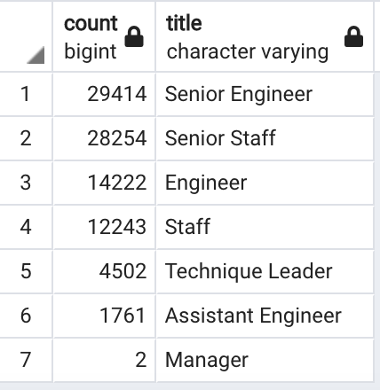
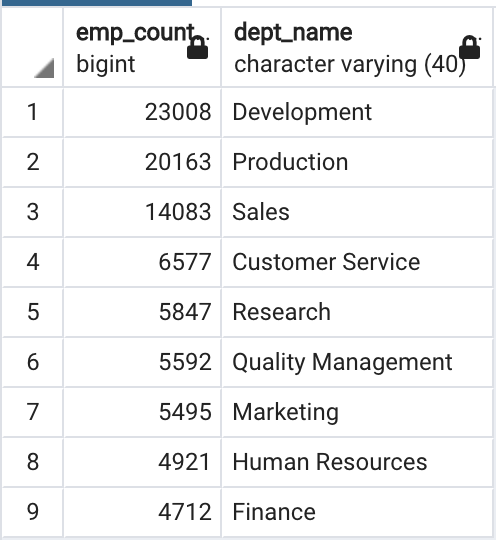
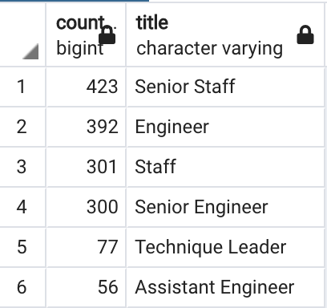

# Pewlett-Hackard-Analysis

## Overview of Project 
Pewlett Hackard is looking ahead as they prepare for a number of upcoming retirements, as the HR team assesses who will be retiring and which positions need to be filled. The purpose of this analysis is to determine the number of retiring employees per job titles and identify employees eligilbile to participate in the mentorship program. A simple query has informed HR that there are 90,398 current employees eligible for the retirement package. When looking at job title, it was important to reference the employees current job title given many of the retirement elibigle employees have held multiple postions throughout the years they have been with Pewlett Hackard. Out of the 90,398 employees, 1,549 are eligible to take on a mentorship role with the company. Through our detailed analysis, we can aid Pewlett Hackward in preparing for the “silver tsunami” as employees reach retirement, leaving many positions to be filled. 

## Results 
#### Employees Eligible for Retirement
- Out of the the 300,024 employees at Pewlett Hackard, 90,398 are eligible for retirement. This would be a 30.13% loss of company personnel. 

#### Retiring Employees by Title 
- Based on the table below, we see that Senior Engineer and Senior Staff account for a good majority of the likely retirees. These positions make up over 50% of the job titles held by retirement eligible employees. I would expect these postions to be top priority for future staffing, given the high demand. 
- Fortunatly, only 2 emloyees within a manager are eligible for retirement. This decreases the demand for new leadership, as well as money spent on manager training programs. 

#### Retirees Eligible for Mentorship Role
- 1,549 employees met the criteria to be step into the mentorship program at Pewlett Hackward. To be eligible for the mentorship program, the employee must have been born in 1965. These emloyees would take on a part-time role as mentoring and teaching the new hires, instead of completely retiring. To add, a majority of these candidates are currenlty in senior postions within the company.   

## Summary
Pewlett Hackward currently employs over 90,0000 people who are eligible for retirement. This is a great loss and creates a large demand to fill the vacant postions. However, this is based off the assumption that all those postions are currently instrumental to the company. With PH looking at a 30% loss of employees, it would be beneficial to review the potential vacant postitons and assess the longevity of the role. Can responsiblities can be delegated? Can roles merge? Is this project team vital to the success of the company? These are all questions Pewlett Hackward should be asking as the “silver tsunami” begins to make its impact. 

Simply put, 1,549 mentors is not enough to successfully and effectively train the next generation of PH employees. In order to combat this imbalance, I would recommend expanding the eligibilty criteria for mentors in order to increase the amount of those eligible for the program. Also, our analysis does not give insight on the location of such eligible mentors, seeing that some locations experiencing company loss may not even have a mentor on staff. With a ratio of 58:1, PH should review the mentorship program as a whole. 

Below are 2 additional queries that could be usful in preparing for the wave of retirement: 

- The table below displays the the number of retirement eligible employees within each department. Based on this analysis, we conclude that the Development, Production, and Sales departments face the greatest potential loss of staff.

- This next table breaks down the list of employees eligible to become a mentor by their job title. This gives insight into which roles can provide the most mentors. We see that the Senior Staff and Engineer roles have the largest amount of eligible mentors, given that those are the roles in which PH will be experiencing the most loss. While these positions do provide the most eligible mentors, it is still necessary to review the mentorship eligibility in order to meet the demand of the new generation of employees. 

